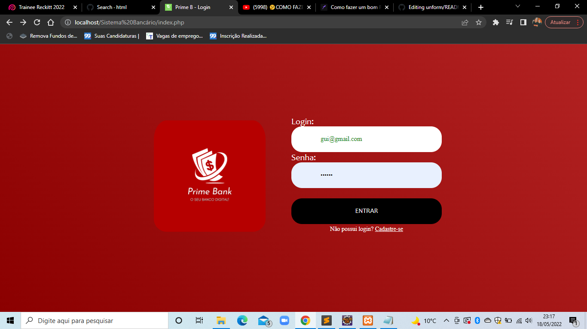
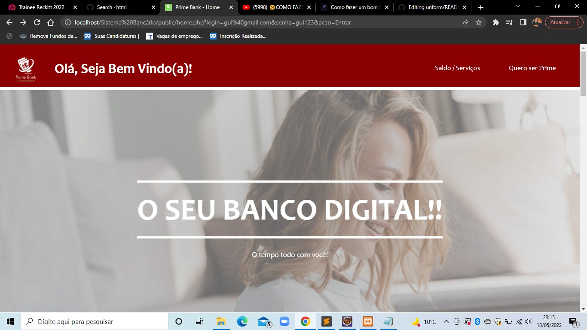
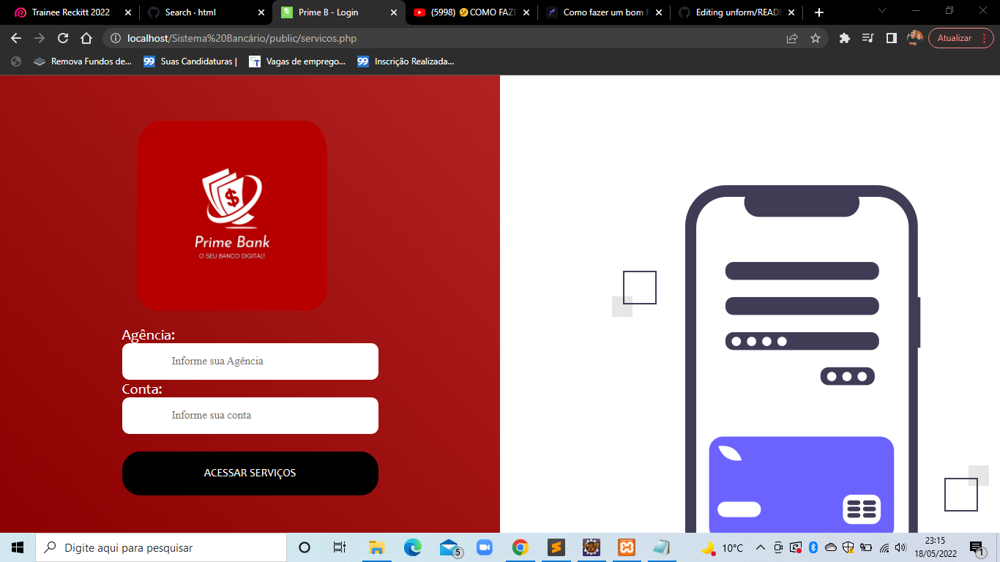
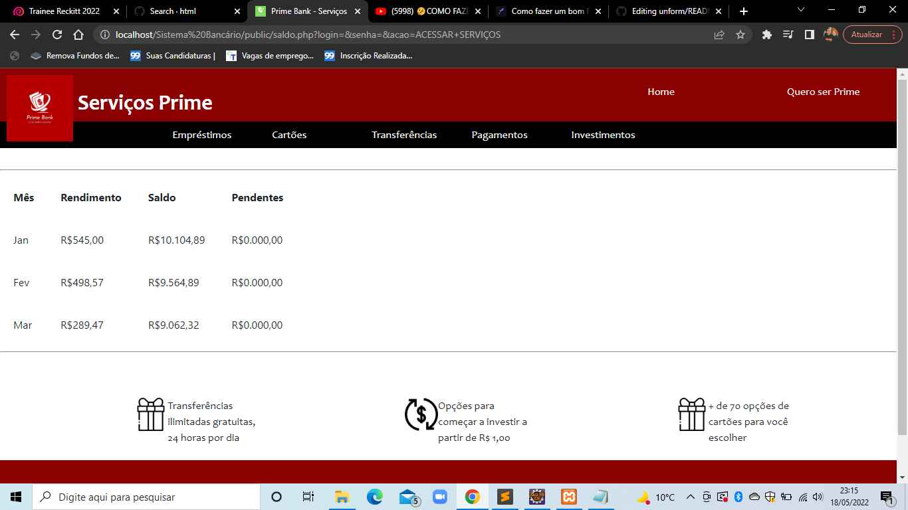

<!DOCTYPE html>
<html lang="pt-br">
    <meta charset="UTF-8">

  

<h1 align="center">Prime Bank</h1>

<h1>Descrição do Projeto</h1>

<h3>Trata-se de um front-end de um Open Bnking contendo a interação direta com o usuário, buscando a total experiência do usuário</h3>

 <a href="#Descrição">Descrição</a> •
 <a href="#Demonstração">Demonstração</a> •
 <a href="#Pré-requisitos">Pré Requisitos</a> • 
 <a href="#Tecnologias Utilizadas">Tecnologias</a> • 

 

	<h1>#Demonstração</h1>

 

 
 
 
 

 	
<h1>#Pré-requisitos</h1>
 

<h3>Antes de começar, você vai precisar ter instalado em sua máquina as seguintes ferramentas: 
[XAMPP](https://www.apachefriends.org/pt_br/index.html) como servidor.  
Além disto é bom ter um editor para trabalhar com o código como [VSCode](https://code.visualstudio.com/)</h3>

<h1>Tecnologias Utilizadas</h1>
 

<h3>Para esse projeto, foram utilizadas as seguintes tecnologias/linguagens de programação: 
[HTML5].  
[CSS].</h3>

